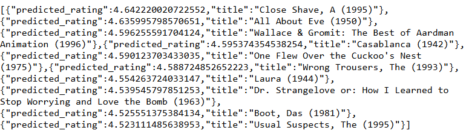

# Рекомендательная система фильмов

Веб-сервис для рекомендации фильмов на основе гибридного подхода. Использует коллаборативную фильтрацию для известных пользователей и контентную фильтрацию для новых.

## 🚀 Как работает

- **Для известных пользователей** (ID есть в базе): рекомендации на основе SVD-модели
- **Для новых пользователей**: рекомендации по жанрам и рейтингу (контентная фильтрация)
- **Интерфейс**: REST API на Flask

## 🛠 Технологии

- Python
- Pandas, NumPy
- Scikit-surprise (SVD)
- Flask
- Ngrok
- Jupyter Notebook

## 📦 Установка и запуск

### Вариант 1: Запуск в Google Colab (рекомендуется)

1. Откройте ноутбук `Рекомендации.ipynb` в [Google Colab](https://colab.research.google.com/)
2. Установите зависимости, выполнив в отдельной ячейке:
   ```python
   !pip install flask==2.3.3 scikit-surprise==1.1.3 pandas==2.0.3 numpy==1.24.3 scikit-learn==1.3.0 pyngrok==7.0.0
   
3. Запустите ячейки в следующем порядке:
* Импорты библиотек
* Создание trainset
* Flask-приложение
4. После запуска ячейки с Flask-приложением скопируйте ngrok-ссылку (она будет вида https://xxxx.ngrok-free.app)

### Вариант 2: Локальный запуск
1. Клонируйте репозиторий:
```bash
git clone https://github.com/olga-chist/olga-data_science
cd olga-data_science/diplom_RecSys
```
2. Установите зависимости:
```bash
pip install -r requirements.txt
```
3. Запустите сервер:
```bash
python app.py
```
4. Откройте в браузере: `http://localhost:5000`

## 📁 Структура проекта
```
diplom_RecSys/
├── data/
│   ├── u.data
│   ├── u.item
│   └── u.user
├── models/
│   └── svd_model.pkl
├── notebooks/
│   ├── EDA.ipynb
│   └── Рекомендации.ipynb
├── requirements.txt
├── recommendation_screenshot.png
└── README.md
```
## 💡 Пример использования
1. Получите ссылку после запуска Flask-приложения

2. Откройте в браузере ссылку вида:
```
https://ваша-ссылка.ngrok-free.app/recommend?user_id=ВВЕДИТЕ_ID
```
3. Вместо `ВВЕДИТЕ_ID` подставьте:
- ID пользователя из датасета (например: 1, 15, 150) - для персонализированных рекомендаций
- Любой другой ID - для рекомендаций на основе контентной фильтрации
  
## 📸 Пример работы
После ввода `user_id=189` сервис возвращает:


## 📊 Результаты
Реализован работающий прототип рекомендательной системы с веб-интерфейсом. Система обрабатывает два сценария и выдает персонализированные рекомендации.

Проект выполнен в рамках обучения Data Science. Для вопросов: olga-chist

text


